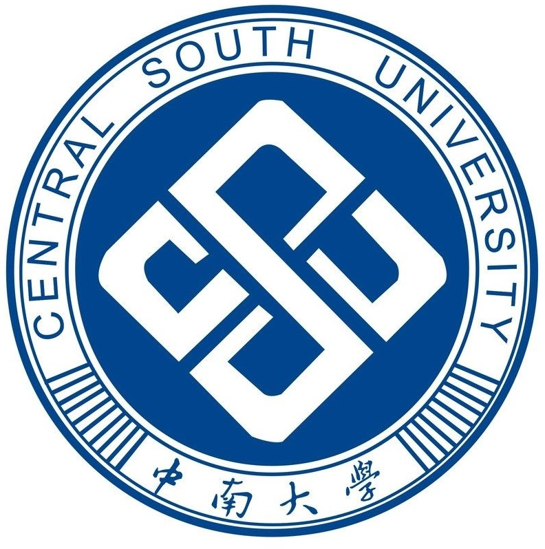








I am currently a final-year master student at School of Software, Tsinghua University. Previously, I received my B.S. with honors from School of Computer Science and Engineering, Central South University. Currently, I am also a visiting student at [Blender Lab](http://blender.cs.illinois.edu/), University of Illinois Urbana-Champaign, working with [Prof. Heng Ji](http://blender.cs.illinois.edu/hengji.html). Before, I was delighted to cooperated with <a href="http://buaahsh.github.io/">Dr. Shaohan Huang</a>, [Yutong Bai](https://yutongbai.com/), [Dr. Guolong Wang](https://scholar.google.com/citations?user=vc0T1NoAAAAJ&hl=zh-CN&oi=sra), [Dr. Feng Zhang](https://cn.linkedin.com/in/gleefeng), [Dr. Jimmy S. Ren](http://www.jimmyren.com/) and [Yaqi Wu](https://scholar.google.com/citations?user=Yk3lxAoAAAAJ). 

<!-- You can find my CV here: [Curriculum Vitae](./files/cv_wuxun_tsinghua_university_2024_fall_PhD_application.pdf).-->

My research aim to build up unified AI system capable of simultaneously processing information from multiple modalities and addressing various downstream tasks. With this goal, I have explored following topics:
* **language-based multi-modal intelligence**: multi-modal learning (e.g., acoustic, visual, language and point clouds modalities), multi-modal retrieval and summarization, downstream adaption (zero-shot learning and cross-modal learning, parameter-efficient fine-tuning).
* **representation learning**: unified vision model for diverse tasks (e.g., object detection, segmentation and reconstruction).
* **low-level vision & computational photography**: mobile imaging system, efficient image reconstruction.

<!-- I have published papers  at the top international AI conferences. -->

# 🔥 News
- *10/2023* 1 paper was submited to WWW 2024.
- *10/2023* 1 paper was submited to ICLR 2024.
- *09/2023* 1 paper was submited to ICASSP 2024.
- *07/2023* &nbsp;🎉 1 [paper](https://ieeexplore.ieee.org/abstract/document/10222116) was accepted to ICIP 2023.
- *04/2023* Join [Natural Language Computing group](https://www.microsoft.com/en-us/research/group/natural-language-computing/) of Microsoft Research Asia (MSRA) as a Research Intern.
- *03/2023* &nbsp;🎉 1 [paper](https://ieeexplore.ieee.org/abstract/document/10095231) was accepted to ICASSP 2023 (Top 3% recongintion).
- *03/2022* &nbsp;👏 Obtain 2nd Place Award at Mobile Intelligent Photography & Imaging (MIPI) Workshop for RGBW Remosaic @ **CVPR 2023**.
- *09/2022* &nbsp;🎉 1 [paper](https://www.sciencedirect.com/science/article/pii/S0306457322002485) was accepted to Information Processing & Management (<b>IPM</b>, IF=8.6).
- *09/2022* &nbsp;👏 Obtain Winner Award (Subjective track) at Mobile AI (AIM) workshop for Learned Smartphone ISP Challenge @ **ECCV 2022**.
- *06/2022* &nbsp;👏 Obtain Winner Award at New Trends in Image Restoration and Enhancement (NTIRE) Workshop @ **CVPR 2022**.
- *06/2022* &nbsp;🎉 1 [paper](https://dl.acm.org/doi/pdf/10.1145/3503161.3548004) was accepted to ACMMM 2022.

# 💻 Research Experience

  
  <ul style="list-style-type: disc; padding-left: 20px;">
    <li style="list-style-type: none;">Natural Language Computing Group (<a href="[https://ccvl.jhu.edu/](https://www.microsoft.com/en-us/research/group/natural-language-computing/)">NLC</a>), Microsoft Research Asia</li>
    <li style="list-style-type: none;"><em>2023.04 - present</em>, <strong>Research intern</strong></li>
    <li style="list-style-type: none;">mentored by <a href="http://buaahsh.github.io/">Shaohan Huang</a></li>
  </ul>

  
  <ul style="list-style-type: disc; padding-left: 0px;">
    <li style="list-style-type: none;">Computational Cognition, Vision, and Learning Group (<a href="https://ccvl.jhu.edu/">CCVL</a>), Johns Hopkins University</li>
    <li style="list-style-type: none;"><em>2023.06 - 2023.09</em>, <strong>Summer intern</strong></li>
    <li style="list-style-type: none;">mentored by <a href="https://yutongbai.com/">Dr. Yutong Bai</a> and <a href="https://www.cs.jhu.edu/~ayuille/">Prof. Alan Yuille</a></li>
  </ul>

  
  <ul style="list-style-type: disc; padding-left: 20px;">
    <li style="list-style-type: none;">AI Sensing & Imaging Group, SenseTime</li>
    <li style="list-style-type: none;"><em>2021.04 - 2023.04</em>, <strong>Computer Vision Research intern</strong></li>
    <li style="list-style-type: none;">mentored by <a href="https://scholar.google.com/citations?user=Yk3lxAoAAAAJ">Yaqi Wu</a> and Dr. Feng Zhang</li>
  </ul>

# 📝 Publications 

#### &nbsp;&nbsp; Multi-modal Intelligence
- ``ArXiv 2023`` [MoLE: Mixture of LoRA Experts](https://openreview.net/pdf?id=uWvKBCYh4S). **Xun Wu**, Shaohan Huang, Furu Wei. ArXiv, 2023.
- ``ICASSP 2023`` [Instance-Aware Hierarchical Structured Policy for Prompt Learning in Vision-Language Models](https://ieeexplore.ieee.org/abstract/document/10095231). **Xun Wu** *, Guolong Wang *, Zhaoyuan Liu, Xuan Dang, Zhen Qin. IEEE International Conference on Acoustics, Speech and Signal Processing (<b>ICASSP</b>), 2023. (Top 3% recongintion)
- ``IPM`` [Reducing 0s bias in video moment retrieval with a circular competence-based captioner](https://www.sciencedirect.com/science/article/pii/S0306457322002485). Guolong Wang, **Xun Wu**, Zhaoyuan Liu, Zhen Qin. Information Processing & Management (<b>IPM</b>, IF=8.6), 2022.
- ``ACMMM 2022`` [Prompt-based Zero-shot Video Moment Retrieval](https://dl.acm.org/doi/pdf/10.1145/3503161.3548004). Guolong Wang *, **Xun Wu** *, Zhaoyuan Liu, JunChi Yan. Proceedings of the 30th ACM International Conference on Multimedia (<b>ACMMM</b>), 2022.

#### &nbsp;&nbsp; Imaging & Low-level Vision

- ``ICIP 2023`` [Joint Demosaicing and Denoising with Gradient Guidance in Quad Bayer CFA](https://ieeexplore.ieee.org/stamp/stamp.jsp?tp=&arnumber=10222116). **Xun Wu** *, Yaqi Wu *, Jiawei Zhang, Feng Zhang, Jimmy S. Ren. IEEE International Conference on Image Processing (<b>ICIP</b>), 2023.
- ``CVPRW 2023`` [OTST: A Two-Phase Framework for Joint Denoising and Remosaicing in RGBW CFA](https://openaccess.thecvf.com/content/CVPR2023W/MIPI/papers/Fan_OTST_A_Two-Phase_Framework_for_Joint_Denoising_and_Remosaicing_in_CVPRW_2023_paper.pdf). Zhihao Fan *, **Xun Wu** *, Fanqing Meng, Yaqi Wu, Feng Zhang. Proceedings of the IEEE/CVF Conference on Computer Vision and Pattern Recognition - 2nd Mobile Intelligent Photography & Imaging Workshop (<b>CVPRW</b>), 2022.
- ``ECCVW 2022`` [Learning to Joint Remosaic and Denoise in Quad Bayer CFA via Universal Multi-scale Channel Attention Network](https://link.springer.com/chapter/10.1007/978-3-031-25072-9_10). **Xun Wu**, Zhihao Fan, Jiesi Zheng, Yaqi Wu, Feng Zhang. European Conference on Computer Vision - 1nd Mobile Intelligent Photography & Imaging Workshop (<b>ECCVW</b>), 2022.
- ``ECCVW 2022`` [Residual Feature Distillation Channel Spatial Attention Network for ISP on Smartphone](https://link.springer.com/chapter/10.1007/978-3-031-25063-7_40). Jiesi Zheng, Zhihao Fan, **Xun Wu**, Yaqi Wu, Feng Zhang. European Conference on Computer Vision - Advances in Image Manipulation workshop and challenges (<b>CVPRW</b>), 2022.

# 💪 Competition
- New Trends in Image Restoration and Enhancement (**NTIRE**) Workshop on Multi-Spectral Filter Array Demosaicing @ **CVPR2022**, Winner Award (**157 teams**)
- Mobile AI (**AIM**) workshop for Learned Smartphone ISP Challenge @ **ECCV2022**, Winner Award
- Mobile Intelligent Photography & Imaging (**MIPI**) Workshop for RGBW Remosaic @ **ECCV2022**, 2nd Place Award (**81 teams**)
- Mobile Intelligent Photography & Imaging (**MIPI**) Workshop for Quad Bayer Remosaic @ **ECCV2022**, 5nd Place

# ✨ Honors and Awards
- *2023.11* Ubiquant Scholarship, Tsinghua University.
- *2023.06* Top-3% Paper recongition, ICASSP 2023.
- *2021.10 - 2023.10* Outstanding Student Award & Second-class Scholarship (**×3**), Tsinghua University.
- *2021.06* Province-level Outstanding Graduate Student Award (**Top 5 in 242 students**), Central South University.
- *2021.06* Outstanding student paper award, Central South University.
- *2020.10* Wanxing Technology Innovation Scholarship (**Top 10 in 242 students**), Central South University.
- *2017.10 - 2021.10* Outstanding Student Award & Second-class Scholarship (**×3**), Central South University.
- *2017.02* Sencond Prize in Provinces, Chinese Physics Olympiad.

# 🎓 Educations
- *2021.09 - present*, Tsinghua University
- *2017.09 - 2021.06*, Central South University.

<!--

  
  <ul style="list-style-type: disc; padding-left: 20px;">
    <li><em>2021.09 - present</em>, School of Software, Tsinghua University</li>
  </ul>

  
  <ul style="list-style-type: disc; padding-left: 20px;">
    <li><em>2017.09 - 2021.06</em>, School of Computer Science and Engineering, Central South University</li>
  </ul>

-->

# 🌚 Miscellaneous
- 🏀 I am a big fan of basketball. I've been in the THU SS basketball team. Back to my undergrad, I was a member of the CSU SCSE basketball team, where we won the 4nd Place of the 2018 CSU Cup basketball tournament.
- 😉 I am very interested in painting as well as traditional Chinese calligraphy.
 
 

