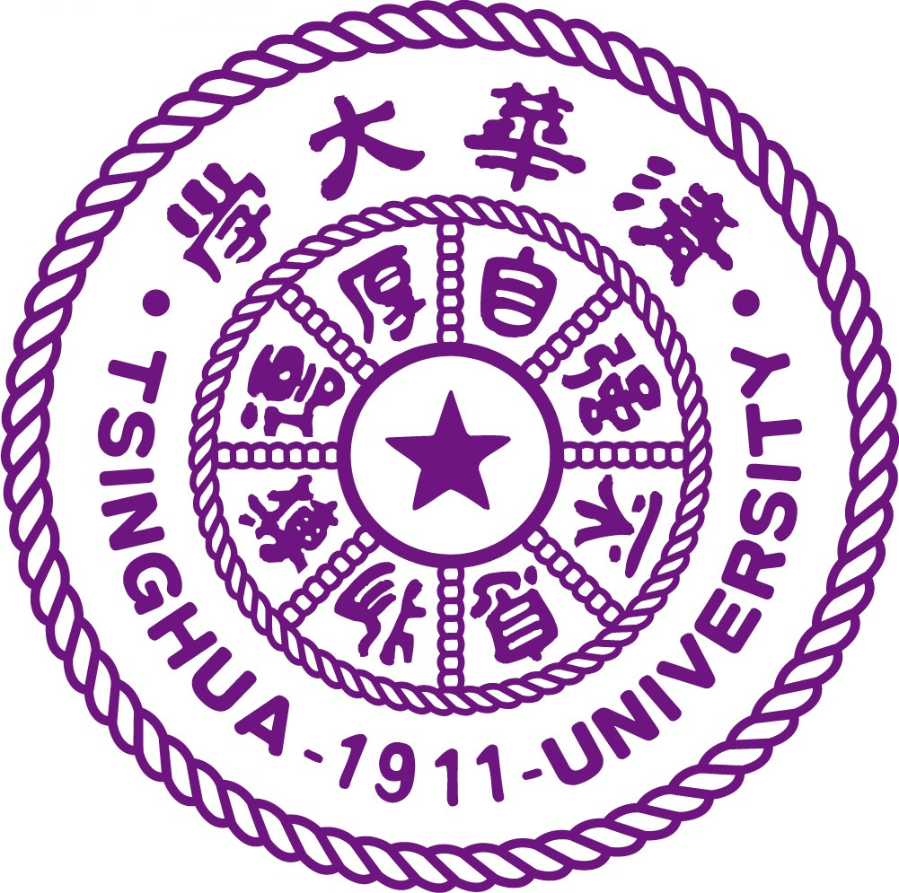








<span class='anchor' id='about-me'></span>

I am currently a final-year master student at School of Software, Tsinghua University. Previously, I received my B.S. from School of Computer Science and Engineering, Central South University, where I was awarded Outstanding Undergraduate Thesis Award (**Top 2%**). Now I am a research intern at Microsoft Research Asia mentored by <a href="http://buaahsh.github.io/">Dr. Shaohan Huang</a>, focusing primarily on **Mixture-of-Experts** and **Multimodal Pre-training**. Prior to this, I spent two years as a research intern at SenseTime, mainly focusing on developing advanced imaging technologies and integrating AI algorithms into imaging sensors and chips. Additionally, I have been a core team member in several international competitions, achieving notable rankings. I have published several papers at top international AI conferences like ICLR/KDD/MM. 

<!--In the course of my research, I am delighted to cooperated with <a href="http://buaahsh.github.io/">Dr. Shaohan Huang</a>, [Dr. Guolong Wang](https://scholar.google.com/citations?user=vc0T1NoAAAAJ&hl=zh-CN&oi=sra), [Dr. Feng Zhang](https://cn.linkedin.com/in/gleefeng), [Dr. Jimmy S. Ren](http://www.jimmyren.com/) and [Yaqi Wu](https://scholar.google.com/citations?user=Yk3lxAoAAAAJ). -->

<!-- You can find my CV here: [Curriculum Vitae](./files/cv_wuxun_tsinghua_university_2024_fall_PhD_application.pdf).-->

My research aim to build up unified AI system capable of simultaneously processing information from multiple modalities and addressing various downstream tasks. With this goal, I have explored following topics:
* **mixture-of-experts**: mixture-of-experts's structure, pretraining and domain adaption.
* **language-based multi-modal intelligence**: multi-modal learning (acoustic, vision, language and point clouds modalities, etc.), multi-modal retrieval, downstream adaption (zero-shot learning, parameter-efficient fine-tuning).
* **alignment & debiasing**: alignment for large language models (LLMs) and diffusion models, RLAIF.

<!-- I have published papers <a href='https://scholar.google.com/citations?user=H6v9t9kAAAAJ'></a> at the top international AI conferences. -->


# 🔥 News
- *05/2024* &nbsp; Two papers were accepted to KDD2024.
- *01/2024* &nbsp; One paper was accepted to ICLR2024.
- *12/2023* &nbsp; One paper was accepted to ICASSP2024.
- *11/2023* &nbsp; One paper was accepted to Information Sciences.
- *07/2023* &nbsp; One [paper](https://ieeexplore.ieee.org/abstract/document/10222116) was accepted to ICIP 2023.
- *04/2023* &nbsp; Join [Natural Language Computing group](https://www.microsoft.com/en-us/research/group/natural-language-computing/) of Microsoft Research Asia (MSRA) as a research intern.
- *03/2023* &nbsp; One [paper](https://ieeexplore.ieee.org/abstract/document/10095231) was accepted to ICASSP 2023 <span style="color:red">(Top 3%)</span>.
- *03/2022* &nbsp; Obtain <span style="color:red">2nd Place Award</span> at Mobile Intelligent Photography & Imaging (MIPI) Workshop for RGBW Remosaic @ **CVPR 2023**.
- *09/2022* &nbsp; One [paper](https://www.sciencedirect.com/science/article/pii/S0306457322002485) was accepted to Information Processing & Management (<b>IPM</b>, IF=8.6).
- *09/2022* &nbsp; Obtain <span style="color:red">3rd Place Award</span> at Mobile AI (AIM) workshop for Learned Smartphone ISP Challenge @ **ECCV 2022**.
- *06/2022* &nbsp; Obtain <span style="color:red">Winner Award</span> at New Trends in Image Restoration and Enhancement (NTIRE) Workshop @ **CVPR 2022**.
- *06/2022* &nbsp; One [paper](https://dl.acm.org/doi/pdf/10.1145/3503161.3548004) was accepted to ACMMM 2022.

# Research Experience
<div style="display: flex; align-items: center;">
  
  <ul style="list-style-type: disc; padding-left: 20px;">
    <li style="list-style-type: none;">Natural Language Computing Group (<a href="[https://ccvl.jhu.edu/](https://www.microsoft.com/en-us/research/group/natural-language-computing/)">NLC</a>), Microsoft Research Asia</li>
    <li style="list-style-type: none;"><em>2023.04 - present</em>, <strong>Research intern</strong></li>
    <li style="list-style-type: none;">mentored by <a href="http://buaahsh.github.io/">Dr. Shaohan Huang</a></li>
  </ul>
</div>

<div style="display: flex; align-items: center;">
  
  <ul style="list-style-type: disc; padding-left: 20px;">
    <li style="list-style-type: none;">AI Sensing & Imaging Group, SenseTime</li>
    <li style="list-style-type: none;"><em>2021.04 - 2023.04</em>, <strong>Computer Vision Research intern</strong></li>
    <li style="list-style-type: none;">mentored by <a href="https://scholar.google.com/citations?user=Yk3lxAoAAAAJ">Yaqi Wu</a> and <a href="https://www.linkedin.com/in/gleefeng/?originalSubdomain=cn">Dr. Feng Zhang</a></li>
  </ul>
</div>


# 📝 Publications 

<em>$^{*}$ indicates co-first author</em>

### &nbsp;&nbsp; 🧑‍🎨 Mixture-of-Experts

<div class='paper-box'><div class='paper-box-image'><div><div class="badge">Arixv</div></div></div>
<div class='paper-box-text' markdown="1">
**[Multi-Head Mixture of Experts](https://arxiv.org/abs/2404.15045)**

**Xun Wu**, <a href="http://buaahsh.github.io/">Shaohan Huang</a>, Wenhui Wang, <a href="https://thegenerality.com/">Furu Wei</a>

-  Significantly increase the expert activation ratio and enhanced fine-grained understanding capabilities in the SMoE model by partitioning tokens before the gating functions.
</div>
</div>

<div class='paper-box'><div class='paper-box-image'><div><div class="badge">ICLR 2024</div></div></div>
<div class='paper-box-text' markdown="1">
**[Mixture of LoRA Experts](https://openreview.net/pdf?id=uWvKBCYh4S)**

<em>International Conference on Learning Representations (**ICLR**), 2024</em>

**Xun Wu**, <a href="http://buaahsh.github.io/">Shaohan Huang</a>, <a href="https://thegenerality.com/">Furu Wei</a>

-  Achieve a flexible and dynamic combination of multiple trained LoRAs through a gating network while preserving their individual characteristics.
</div>
</div>


<div class='paper-box'><div class='paper-box-image'><div><div class="badge">KDD 2024</div></div></div>
<div class='paper-box-text' markdown="1">
**Routing Evidence for Unseen Actions in Video Moment Retrieval** (paper released soon)
  
<em>SIGKDD Conference on Knowledge Discovery and Data Mining (**KDD**), 2024</em>

<a href="https://scholar.google.com/citations?user=vc0T1NoAAAAJ&hl=zh-CN&oi=sra">Guolong Wang</a> *, **Xun Wu** *, Zhen Qin, Liangliang Shi

-  Propose Routing Evidence (RE) by investigating mixture of prediection heads with uncertainty estimator (e.g., evidence learning), and achieve state-of-the-art out-of-domain (e.g., unseen actions) retrival performance on video moment retrieval task.

</div>
</div>


<!--
- <span style="background-color: #003366; color: white; padding: 1px 4px; font-size: 12px;">``Arixv``</span> [Multi-Head Mixture of Experts](https://arxiv.org/abs/2404.15045). **Xun Wu**, Shaohan Huang, Wenhui Wang, Furu Wei. Arixv, 2024.
- <span style="background-color: #003366; color: white; padding: 1px 4px; font-size: 12px;">``ICLR 2024``</span> [Mixture of LoRA Experts](https://openreview.net/pdf?id=uWvKBCYh4S). **Xun Wu**, Shaohan Huang, Furu Wei. International Conference on Learning Representations (<b>ICLR</b>), 2024.
- <span style="background-color: #003366; color: white; padding: 1px 4px; font-size: 12px;">``KDD 2024``</span> Routing Evidence for Unseen Actions in Video Moment Retrieval. Guolong Wang *, **Xun Wu** *, Zhen Qin, Liangliang Shi. SIGKDD Conference on Knowledge Discovery and Data Mining (<b>KDD</b>), 2024.
```
-->

### &nbsp;&nbsp; 📚 Multi-modal Intelligence


<div class='paper-box'><div class='paper-box-image'><div><div class="badge">ACMMM 2022</div></div></div>
<div class='paper-box-text' markdown="1">
**[Prompt-based Zero-shot Video Moment Retrieval](https://dl.acm.org/doi/pdf/10.1145/3503161.3548004)**

<em>ACM Multimedia Conference (**ACMMM**), 2022</em> 

<a href="https://scholar.google.com/citations?user=vc0T1NoAAAAJ&hl=zh-CN&oi=sra">Guolong Wang *</a>, **Xun Wu** *, Zhaoyuan Liu, <a href="https://scholar.google.com/citations?user=ga230VoAAAAJ">JunChi Yan</a>

-  Propose.

</div>
</div>


<div class='paper-box'><div class='paper-box-image'><div><div class="badge">Arixv</div></div></div>
<div class='paper-box-text' markdown="1">
**[Multimodal Large Language Model is a Human-Aligned Annotator for Text-to-Image Generation](https://arxiv.org/abs/2404.15100)**

**Xun Wu**, <a href="http://buaahsh.github.io/">Shaohan Huang</a>, <a href="https://scholar.google.com/citations?user=vc0T1NoAAAAJ&hl=zh-CN&oi=sra">Guolong Wang</a>, <a href="https://thegenerality.com/">Furu Wei</a>

-  Propose VisionPrefer and VP-Score.

</div>
</div>

- <span style="background-color: #003366; color: white; padding: 1px 4px; font-size: 12px;">``ICASSP 2023``</span> [Instance-Aware Hierarchical Structured Policy for Prompt Learning in Vision-Language Models](https://ieeexplore.ieee.org/abstract/document/10095231). **Xun Wu** *, Guolong Wang *, Zhaoyuan Liu, Xuan Dang, Zhen Qin. IEEE International Conference on Acoustics, Speech and Signal Processing (<b>ICASSP</b>), 2023. <span style="color:red">(Top 3% recongintion)</span>
- <span style="background-color: #003366; color: white; padding: 1px 4px; font-size: 12px;">``IPM``</span> [Reducing 0s bias in video moment retrieval with a circular competence-based captioner](https://www.sciencedirect.com/science/article/pii/S0306457322002485). Guolong Wang, **Xun Wu**, Zhaoyuan Liu, Zhen Qin. Information Processing & Management (<b>IPM</b>, IF=8.6), 2022.
- <span style="background-color: #003366; color: white; padding: 1px 4px; font-size: 12px;">``Information Sciences``</span> [Proaressive Reinforcement Learning for Video Summarization](https://www.sciencedirect.com/science/article/pii/S0020025523014731). Guolong Wang *, **Xun Wu** *, JunChi Yan. Information Sciences (<b>IS</b>, IF=8.1), 2023.


### &nbsp;&nbsp; Imaging & Low-level Vision (no longer my primary focus)

<div class='paper-box'><div class='paper-box-image'><div><div class="badge">ICIP 2023</div></div></div>
<div class='paper-box-text' markdown="1">
**[Joint Demosaicing and Denoising with Gradient Guidance in Quad Bayer CFA](https://ieeexplore.ieee.org/abstract/document/10222116)**

**Xun Wu** *, Yaqi Wu * , [Jiawei Zhang](https://scholar.google.com/citations?user=0GTpIAIAAAAJ), [Feng Zhang](https://cn.linkedin.com/in/gleefeng), [Jimmy S. Ren](http://www.jimmyren.com/)

-  

</div>
</div>

- <span style="background-color: #003366; color: white; padding: 1px 4px; font-size: 12px;">``ICME 2024``</span> Improving Image Reconstruction and Synthesis by Balancing the Optimization from Frequency Perspective. **Xua Dang** *, **Xun Wu** *, Guolong Wang, Zhen Qin. IEEE International Conference on Multimedia and Expo (<b>ICME</b>), 2024. <span style="color:red">(Oral)</span>


- <span style="background-color: #003366; color: white; padding: 1px 4px; font-size: 12px;">``ICIP 2023``</span> [Joint Demosaicing and Denoising with Gradient Guidance in Quad Bayer CFA](https://ieeexplore.ieee.org/stamp/stamp.jsp?tp=&arnumber=10222116). **Xun Wu** *, Yaqi Wu *, Jiawei Zhang, Feng Zhang, Jimmy S. Ren. IEEE International Conference on Image Processing (<b>ICIP</b>), 2023.

<!-- - <span style="background-color: #003366; color: white; padding: 1px 4px; font-size: 12px;">``CVPRW 2023``</span> [OTST: A Two-Phase Framework for Joint Denoising and Remosaicing in RGBW CFA](https://openaccess.thecvf.com/content/CVPR2023W/MIPI/papers/Fan_OTST_A_Two-Phase_Framework_for_Joint_Denoising_and_Remosaicing_in_CVPRW_2023_paper.pdf). Zhihao Fan *, **Xun Wu** *, Fanqing Meng, Yaqi Wu, Feng Zhang. Proceedings of the IEEE/CVF Conference on Computer Vision and Pattern Recognition - 2nd Mobile Intelligent Photography & Imaging Workshop (<b>CVPRW</b>), 2022.
- <span style="background-color: #003366; color: white; padding: 1px 4px; font-size: 12px;">``ECCVW 2022``</span> [Learning to Joint Remosaic and Denoise in Quad Bayer CFA via Universal Multi-scale Channel Attention Network](https://link.springer.com/chapter/10.1007/978-3-031-25072-9_10). **Xun Wu**, Zhihao Fan, Jiesi Zheng, Yaqi Wu, Feng Zhang. European Conference on Computer Vision - 1nd Mobile Intelligent Photography & Imaging Workshop (<b>ECCVW</b>), 2022.
- <span style="background-color: #003366; color: white; padding: 1px 4px; font-size: 12px;">``ECCVW 2022``</span> [Residual Feature Distillation Channel Spatial Attention Network for ISP on Smartphone](https://link.springer.com/chapter/10.1007/978-3-031-25063-7_40). Jiesi Zheng, Zhihao Fan, **Xun Wu**, Yaqi Wu, Feng Zhang. European Conference on Computer Vision - Advances in Image Manipulation workshop and challenges (<b>CVPRW</b>), 2022. -->

# Competition
- New Trends in Image Restoration and Enhancement (**NTIRE**) Workshop on Multi-Spectral Filter Array Demosaicing @ **CVPR2022**, <span style="color:red">Winner Award</span> (**157 teams**)
- Mobile AI (**AIM**) workshop for Learned Smartphone ISP Challenge @ **ECCV2022**, <span style="color:red">3rd Place Award</span>
   - <span style="background-color: #003366; color: white; padding: 1px 4px; font-size: 12px;">``ECCVW 2022``</span> [Residual Feature Distillation Channel Spatial Attention Network for ISP on Smartphone](https://link.springer.com/chapter/10.1007/978-3-031-25063-7_40). Jiesi Zheng, Zhihao Fan, **Xun Wu**, Yaqi Wu, Feng Zhang. European Conference on Computer Vision - Advances in Image Manipulation workshop and challenges (<b>CVPRW</b>), 2022.
- Mobile Intelligent Photography & Imaging (**MIPI**) Workshop for RGBW Remosaic @ **ECCV2022**, <span style="color:red">2nd Place Award</span> (**81 teams**)
  - <span style="background-color: #003366; color: white; padding: 1px 4px; font-size: 12px;">``CVPRW 2023``</span> [OTST: A Two-Phase Framework for Joint Denoising and Remosaicing in RGBW CFA](https://openaccess.thecvf.com/content/CVPR2023W/MIPI/papers/Fan_OTST_A_Two-Phase_Framework_for_Joint_Denoising_and_Remosaicing_in_CVPRW_2023_paper.pdf). Zhihao Fan *, **Xun Wu** *, Fanqing Meng, Yaqi Wu, Feng Zhang. Proceedings of the IEEE/CVF Conference on Computer Vision and Pattern Recognition - 2nd Mobile Intelligent Photography & Imaging Workshop (<b>CVPRW</b>), 2022.
  
- Mobile Intelligent Photography & Imaging (**MIPI**) Workshop for Quad Bayer Remosaic @ **ECCV2022**, <span style="color:red">5nd Place</span>
  - <span style="background-color: #003366; color: white; padding: 1px 4px; font-size: 12px;">``ECCVW 2022``</span> [Learning to Joint Remosaic and Denoise in Quad Bayer CFA via Universal Multi-scale Channel Attention Network](https://link.springer.com/chapter/10.1007/978-3-031-25072-9_10). **Xun Wu**, Zhihao Fan, Jiesi Zheng, Yaqi Wu, Feng Zhang. European Conference on Computer Vision - 1nd Mobile Intelligent Photography & Imaging Workshop (<b>ECCVW</b>), 2022.

# Honors and Awards
- *2023.11* Ubiquant Scholarship, Tsinghua University.
- *2023.06* Top-3% Paper recongition, ICASSP 2023.
- *2021.10 - 2023.10* Outstanding Student Award & Second-class Scholarship (**×3**), Tsinghua University.
- *2021.06* Province-level Outstanding Graduate Student Award (**Top 5 in 242 students**), Central South University.
- *2021.06* Outstanding student paper award, Central South University.
- *2020.10* Wanxing Technology Innovation Scholarship (**Top 10 in 242 students**), Central South University.
- *2017.10 - 2021.10* Outstanding Student Award & Second-class Scholarship (**×3**), Central South University.
- *2017.02* Sencond Prize in Provinces, Chinese Physics Olympiad.


# Educations
- *2021.09 - present*, Tsinghua University
- *2017.09 - 2021.06*, Central South University.

<!--
<div style="display: flex; align-items: center;">
  
  <ul style="list-style-type: disc; padding-left: 20px;">
    <li><em>2021.09 - present</em>, School of Software, Tsinghua University</li>
  </ul>
</div>

<div style="display: flex; align-items: center;">
  
  <ul style="list-style-type: disc; padding-left: 20px;">
    <li><em>2017.09 - 2021.06</em>, School of Computer Science and Engineering, Central South University</li>
  </ul>
</div>
-->

# Academic Services
Conference Reviewer:
- 2024 CVPR, NIPS, MM, KDD
- 2023 MM, ICASSP, CVPR

# Miscellaneous
- 🏀 I am a big fan of basketball. I've been in the THU SS basketball team. Back to my undergrad, I was a member of the CSU SCSE basketball team, where we won the 4nd Place of the 2018 CSU Cup basketball tournament.
- 😉 I am very interested in painting as well as traditional Chinese calligraphy.
<br>
<br>
<script type="text/javascript" id="clustrmaps" src="//clustrmaps.com/map_v2.js?d=q5yZ95KjsZ7AOjImFnG6K7CAzgEw1bXRYg2t7KBkpvY&cl=ffffff&w=200"></script>

